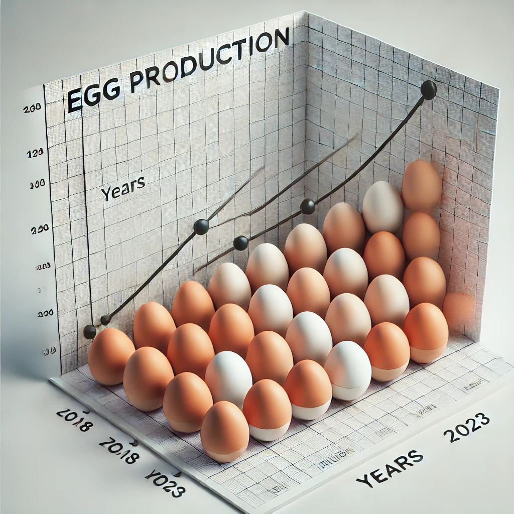

🍳 Egg Production Management System
A simple and interactive web app to monitor egg production, feeding, and statistics for poultry farms. Users can view reports, visualize data, and maintain efficiency in egg-related operations.

🖼 Preview


✅ Live Features
- 📊 View Indian Egg Production Stats
- 🐔 Track feeding and egg collection visually
- 👥 Subscriber Page for engagement
- 📷 Embedded imagery for a user-friendly dashboard
- 💡 Intuitive navigation with multiple HTML views
- 🌐 Live link: [Egg Management Live App](https://pavankasala.github.io/EGG_PRODUCTION_MANAGEMENT)

🛠 Tech Stack
- HTML5
- CSS3
- JavaScript
- Visual content: PNG/JPG assets

🚀 How to Run Locally

1. Clone the repository:
```bash
git clone https://github.com/Pavankasala/EGG_PRODUCTION_MANAGEMENT.git
